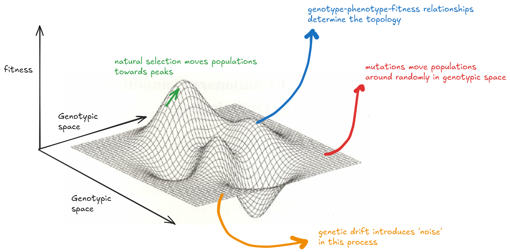

# Introduction

Physicists have spent a lot of time looking for a grand theory to unify the discipline; biologists were gifted one with the theory of evolution in the 19th century. I don’t think evolution alone has the explanatory power to describe all biological processes, but rather that evolution is the framework within which all of biology is contextualised. It is omnipresent, from viruses to elephants to mosses, and it is causally responsible for the 'endless forms most beautiful and most wonderful'. 

Evolution is a complex phenomenon, and often manifests patterns that seem to be in conflict with each other. Evolution generates both convergence and divergence in form and function. Sometimes, it is highly predictable and repeatable; other times it is idiosyncratic. Inspite of this, evolution can be broken down to a few key components, and these components are best explained through the metaphor of the 'fitness landscape'. 

The XY plane is a low-dimensional representation of 'genotypic space', where each point in the plane represents a unique set of alleles or mutations. The process of mutagenesis is random, or nearly so, and is modelled by movement between points on this plane as the genotype of an individual or population changes. The Y axis is the fitness of each of those genotypes, and is determined by the interaction between the phenotypes and the abiotic/ biotic environment. Beneficial phenotypes are fitness peaks on the landscape, while deleterious phenotypes are valleys. The genotype-phenotype-fitness map is difficult to predict because many non-additive processes (like epistasis) and emergent phenomena occur that cannot be predicted by simply 'summing up the parts' or adding the effect of indivdual variants. Regdarless of the topology of this landscape, natural selection (or the 'survival of the fittest' principle) will work to maximize fitness, which is represented by climbing towards peaks. Finally, genetic drift causes differential propagation of genotypes independent of their fitness, and introduces 'noise' or stochasticity.

The overarching goal of this project is two-fold:

1. Can these major evolutionary processes be captured in a computer simulation?
2. Does this simultion recapitulate some expected evolutionary outcomes?

`picocell` is an in-silico simualtion that combines a protein large language model, probabilistic models of mutation and drift, with a rule-based approach of fitness-maximizing natural selection. `picocell` has several flexible parameters that can be changed to observe different outcomes. Please see [the methods](methods.md) to understand how this is implemented, or the [the code page](code.md) to learn to use it. 

