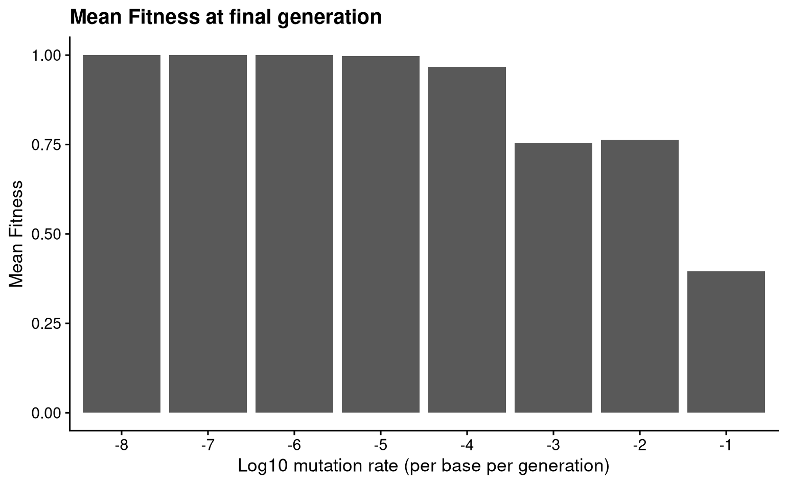
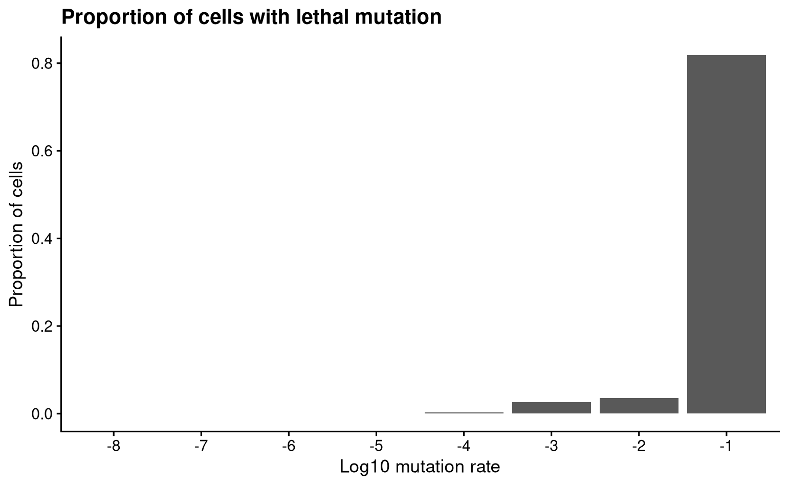
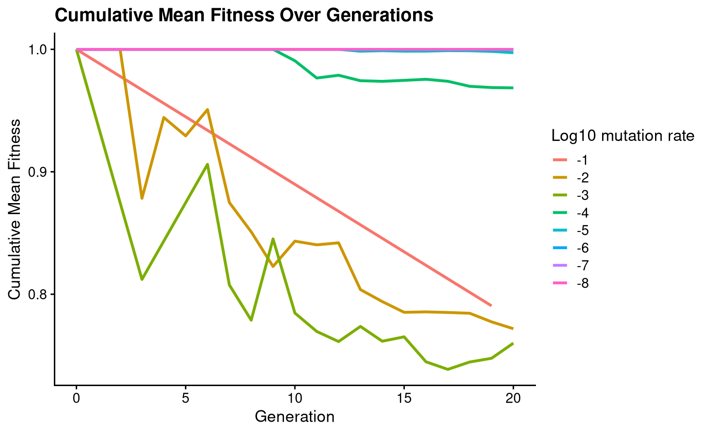
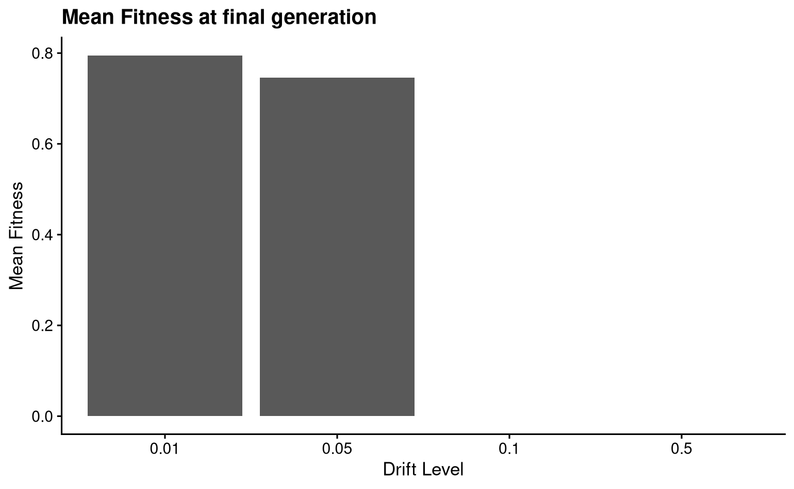
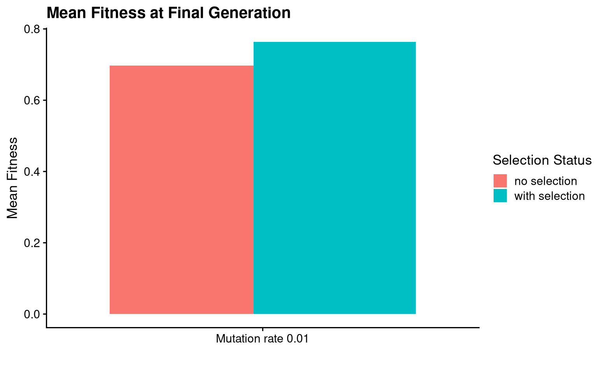

# Results

To address the second goal of this project, I ran several simulations where I varied the different parameters (mutation rate, strength of genetic drift, presence of selection) to determine if `picocell` recapitulates some expected behaviour of the general evolutionary process. All simulations were run for a total of 20 generations, although some terminated prior to this end point if all cells prematurely died. Results were plotted in R with `ggplot`.

### High mutation rate is deleterious and causes fitness decline

Mutations are the primary source of genotypic novelty, and provide the raw material necessary for evolution and adaptation. However high mutation rates can cause a decline in the fitness of a population by increasing the rate of deleterious mutations. I predicted that within the time frame of the simulation, the mean fitness of the cells at the final time point declines with increasing mutation rates.

Fig: Mean population fitness at 20 generations for simulations run with different mutation rates. Rates indicated are per base per generation.

For mutation rates between $10^{-8} - 10^{-4}$, the fitness remains at or close to the wildtype fitness. This is because the mutation rate is so low, and the coding sequence is short, that few to no mutations arise, and all of the offspring retain the parental wildtype fitness. For mutation rates $>10^{-4}$, the rate is high enough to see multiple mutations arise over the course of the simulation. Indeed, we do observe falling population fitness under very high mutation rates. 

Furthermore, we also expect that under conditions of high mutation rate, a greater proportion of the cells born in the experiment will have lethal mutations. Indeed, we observe this pattern.

Fig: Proportion of cells with a lethal mutation, for simulations run with different mutation rates.

Finally, if we plot the trajectory of the fitness of the population over time, we can see that the decline in fitness occurs more rapidly with higher mutation rates.

Fig: Mean population fitness over time, for simulations run with different mutation rates. Rates shown are log10 rates.

The decline does perfectly correspond with increasing mutation rates, as these lines are only represent a single simulation and randomness influences these fitness trajectories. The pattern would hold more strongly if the trajectories were computed from the mean of several runs. Furthermore, because the population starts out with high fitness (i.e. already at a fitness peak), most mutations are deleterious, and we do not observe any of the populations increasing fitness above the ancestral value. Natural selection has a compounding effect, and it is possible that over more generations, rare beneficial variants will have enough time to take over the population and increase the mean value above the wildtype level. However for this short duration, I did not observe this.

### Genetic drift reduces population fitness

Genetic drift causes the differential persistence of population members, regardless of their fitness. Under conditions of strong genetic drift, we expect that the mean population fitness should reduce. In these simulations, genetic drift is implemented by randomly killing each cells at each generations with probability $P(death) = d$. 

Fig: Mean population fitness at 20 generations, for different levels of genetic drift in the simulation.

Mean fitness declines when drift increases from 0.01 to 0.05. However, fitness is 0 for drift >0.1. This is because at this level of drift, the probability of dying randomly is comparable or greater than the probability of reproducing. In these simulations, no cells survive to the end, which is why fitness is 0.

### Natural selection increases population fitness

`picocell` can be run in two modes: with and without selection. We predict that in the absence of natural selection (i.e. all genotypes have an equal chance of reproducing, independent of their fitness), the mean population fitness will be lower. 

Fig: Mean fitness at the final time point, for a simulation run with and without natural selection.

